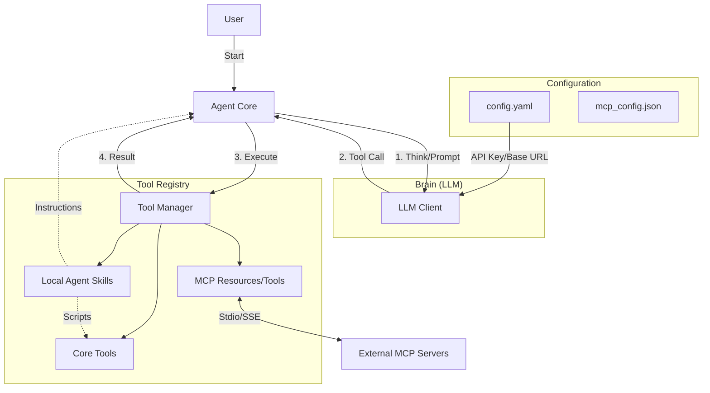

# AgentLite Architecture Design

## 1. Overview

AgentLite is a lightweight, extensible AI agent framework designed to mimic the core capabilities of advanced coding assistants (like Cursor/ClaudeCode) while allowing flexible integration of custom skills and the Model Context Protocol (MCP).

**Core Philosophy:**

- **Lightweight**: Minimal overhead, focused on the "Brain -> Tool -> Action" loop.
- **Extensible**: "Batteries included" (Core tools) but "Pluggable interface" (Skills & MCP).
- **Standardized**: Uses OpenAI-compatible API for LLM backend.

## 2. System Architecture



## 3. Configuration

Configuration is split into general settings (`config.yaml`) and MCP connections (`mcp_config.json`).

### 3.1 General Configuration (`config.yaml`)

```yaml
llm:
  vendor: "openai" # or azure, anthropic (via adapter)
  base_url: "https://api.openai.com/v1" # User requested configurable Base URL
  api_key: "${OPENAI_API_KEY}" # Can reference env vars
  model: "gpt-4-turbo"

storage:
  skills_path: "./skills" # Directory for standard agent-skills
  mcp_config_path: "./mcp_config.json" # Path to MCP server definitions
```

### 3.2 MCP Configuration (`mcp_config.json`)

Standard Format (Compatible with Claude Desktop):

```json
{
  "mcpServers": {
    "git": {
      "command": "uvx",
      "args": ["mcp-server-git", "--repository", "."]
    },
    "filesystem": {
      "command": "npx",
      "args": ["-y", "@modelcontextprotocol/server-filesystem", "."]
    }
  }
}
```

## 4. Module Details

### 4.1 Core Module (`AgentCore`)

The heart of the system.

- **Cycle**:
  1.  **Prepare Context**: System prompt + Conversation History + Available Tools (JSON Schema).
  2.  **Inference**: Call LLM `chat.completions.create` with `tools` param.
  3.  **Dispatch**: If LLM requests a tool, parse arguments and send to **Tool Registry**.
  4.  **Feedback**: Capture Tool output (stdout/stderr/return value) and append to history as `tool` role.
  5.  **Repeat**: Until LLM outputs final answer or user interrupts.

### 4.2 Agent Skills (Standardized)

Compliant with [agentskills.io](https://agentskills.io) specification.

**Structure**:
Each skill is a directory containing a `SKILL.md` file and optional `scripts/` folder.

**Example Structure**:

```
skills/
└── pdf-processing/
    ├── SKILL.md         # Instructions & Metadata
    └── scripts/
        └── extract.py   # Helper script
```

**SKILL.md Format**:

```markdown
---
name: pdf-processing
description: Extract text and tables from PDF files.
license: MIT
---

# PDF Processing

To extract text from a PDF, run the provided python script:
`python skills/pdf-processing/scripts/extract.py <input_file>`
```

**Integration**:

1.  **Loader**: On startup, scan `skills/*/SKILL.md`.
2.  **Context**: Inject `name` and `description` of all available skills into the LLM's **System Prompt**.
3.  **Usage**: When the LLM decides to use a skill, it can either:
    - Rely on the summary description (if sufficient).
    - Read the standard `SKILL.md` (via `read_file` or `view_skill` tool) for detailed instructions.
    - Execute the scripts within the skill using the `bash` tool.

### 4.3 MCP Integration

Enables connection to the growing ecosystem of MCP servers.

**Mechanism**:

- **Client**: Implements an MCP Client (using `mcp-python-sdk` or custom implementation).
- **Transport**: Supports `StdioServerParameters` to spawn subprocesses (e.g., `uvx mcp-server-postgres`).
- **Initialization**:
  1.  Parse `mcp_config.json`.
  2.  Launch subprocesses.
  3.  Perform `initialize` handshake.
  4.  Call `tools/list` to discover capabilities.
  5.  Register these as callable tools in the **Tool Registry**.
- **Execution**:
  - When LLM calls an MCP tool, the Agent forwards the call via JSON-RPC `tools/call` to the respective subprocess.

## 5. Directory Structure

```
agent-lite/
├── config.yaml            # Main config
├── mcp_config.json        # MCP server config
├── main.py                # Entry point
├── requirements.txt
├── core/
│   ├── __init__.py
│   ├── agent.py           # Evaluation Loop
│   ├── llm.py             # OpenAI Wrapper
│   ├── tools.py           # Tool Registry & Schema Generator
│   └── mcp_client.py      # MCP Handler
└── skills/                # Agent Skills (agentskills.io standard)
    ├── __init__.py
    └── example-skill/     # Skill Directory
        ├── SKILL.md       # Skill Definition
        └── scripts/       # Helper scripts
```

## 6. Implementation Stages

1.  **Stage 1: Core & Config**: Setup LLM connection, Agent Loop, and Config Loader.
2.  **Stage 2: Skill Loader**: Implement `SKILL.md` parser (Frontmatter/Body) and Context Injector.
3.  **Stage 3: MCP Support**: Implement the MCP Client and Process Manager.
4.  **Stage 4: TUI/CLI**: Build the "Lightweight" command-line interface.
